Don't you think its fascinating how lines and circles are rendered on pixels?
I've been wanting to do this for a while now, to code from scratch Brehensam and Wu's line algorithm in Golang.

<!-- # Table of Contents
1. [Introduction](#Introduction)
2. [Good ol' Brehensam](#Goodol'Brehensam)
3. [Anti-aliasing you say?](#Anti-aliasing you say?) -->

## Introduction

Rasterization turns out to be one of those things that are really old and widely used, yet it is among the least understood rendering technique among most people who rely on it daily (I'm looking at you dear reader). Perhaps let's start with a problem that Rasterization actually solves.
Note: ([For Rastafari, please refer to this link](https://en.wikipedia.org/wiki/Rastafari))

Let's start with drawing a line from a center of one grid (point A) to another (point B) on a pixelized screen. What would have been a simple affair is now something that we have to wrangle with: How can we represent lines between arbitrary points as pixels?

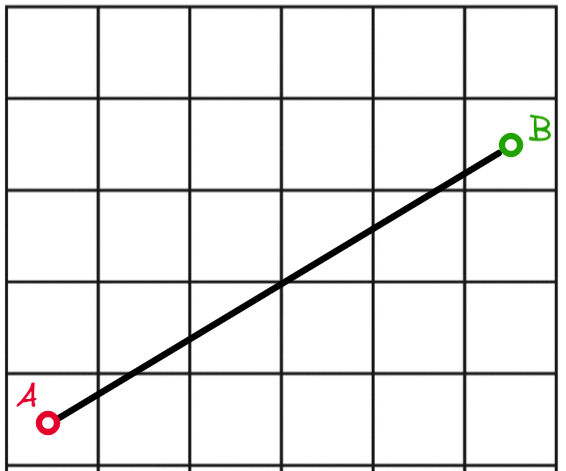

__Figure 1: A simple line AB__

Even if we have all the time in the world and choose to manually colorize pixels to achieve the perfectly rasterized line, we might not end up with a set of pixels that best represent the line AB.

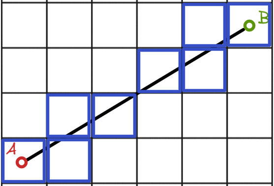

__Figure 2: An attempt at rasterizing line AB__

Let's compare this to actually using a rasterization algorithm (Brehensam's Line Algorithm). But the question remains: How do we know what if the rasterized result is actually the closest approximation/representation of the actual line? On what mathematical basis can we decide this? 

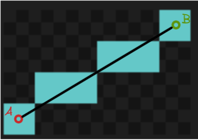

__Figure 3: Line AB rasterized using Brehensam's Algorithm__


## Good ol' Brehensam
Let's take a look at the Brehensam Line Algorithm, a classic line rasterization algorithm still in great use today. It was developed in 1962 at IBM [1] for a [Calcomp Plotter](https://en.wikipedia.org/wiki/Calcomp_plotter). 
There are plenty of articles out there explaining the Brehensam Line Algorithm and there is a [particular one I like](https://www.cs.helsinki.fi/group/goa/mallinnus/lines/bresenh.html). I think he did a hella good job and I would like to build upon Colin's work and focus on the intuition which will lead us to the algorithm.

Small note: Some articles tend to use the following coordinate frame, taking the top left as the origin (0,0), right as positive x direction, and downwards as the positive y direction.

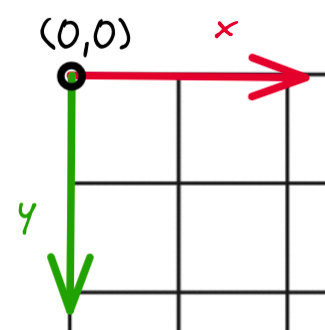

__Figure 4: Image Coordinate Frame__

To keep it visually intuitive. I will instead use the graph coordinate frame, and not worry about how it will translate to the image coordinate frame for now: 

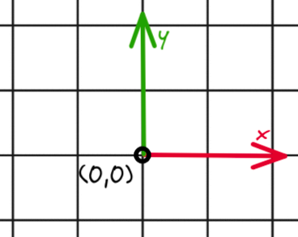

__Figure 5: Graph Coordinate Frame__

## Problem Statement

The problem statement is to represent a line from point A(x1, y1) to B(x2, y2) on a grid. We make the following assumptions:
1. The start and end points coordinate are integers. 
2. We will only be incrementing x as we plot the line. 

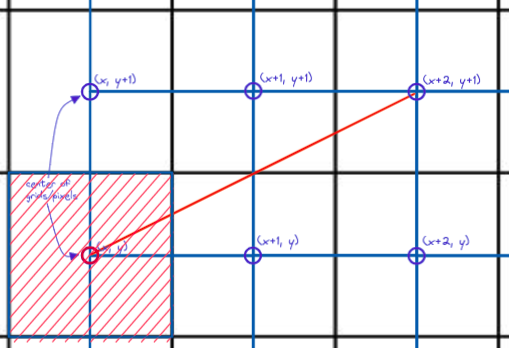

__Figure 6: Problem Set up__

Given the following assumption, it suffices to say that we have only 2 possible choices from which to plot. Will it be (x+1, y) in figure 7 or (x+1, y+1) in figure 8?
Brehensam's algorithm will be alternating between these 2 choices for the first octant.

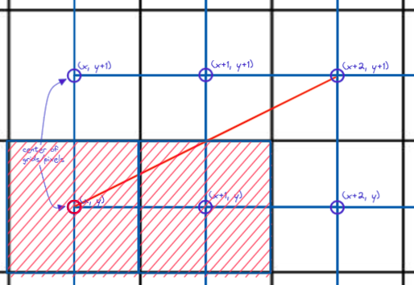

__Figure 7: Pixelize (x+1, y)__

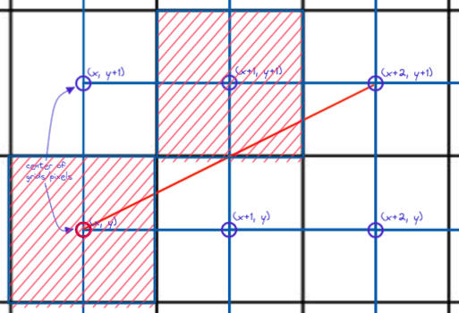

__Figure 8: Or pixelize (x+1, y+1)?__

However, as we start iterating through the algorithm, we will notice that the center of the plotted grid will have an error offset from the ACTUAL line. This is illustrated in figure 9.
```
#x1 and y1 are starting coordinates of the line
x = x1, y = y1

#Iteration 0
Actual line coordinate = (x, y)
Rasterized grid = (x, y)

#Iteration 1
Actual line coordinate = (x, y + e)
Rasterized grid = (x + 1, y)

#Iteration 2
Actual line coordinate = (x, y + e + m)
Rasterized grid = (x + 2, y + 1)

```

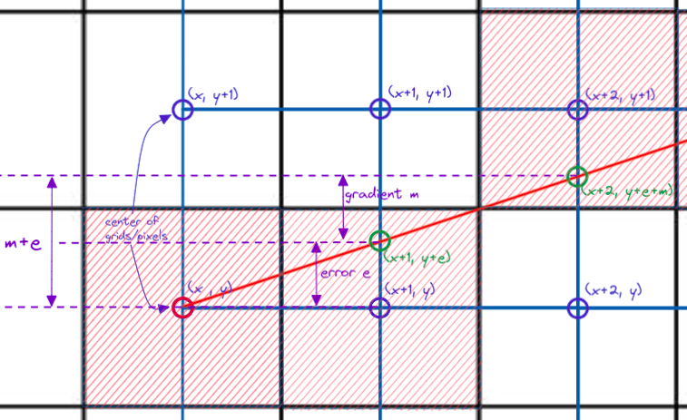

__Figure 9: Error offset of y coordinate__

To determine which grid to actually plot on, we have to focus on the difference between the rasterized y coordinate and the actual line y coordinate. In the example above, we will only plot on (x+2, y+1) if:
> **y + e + m >= y + 0.5**

Similarly, we will only plot on (x+2, y) if:
> **y + e + m < y + 0.5**

After plotting on each increment of x, we notice that now the error has changed, and how the error changes depends on whether we pick (x+2, y+1) or (x+2, y).
If we pick (x+2, y+1), the new error is now:
> **e_new** = (y + e_old + m) - (y + 1)
> **e_new** = e_old + m - 1

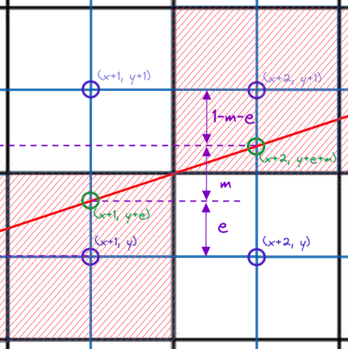

__Figure 10: New error for picking (x+2, y+1)__

If we pick (x+2, y), the new error is now:
> **e_new** = (y + e_old + m) - (y)
> **e_new** = e_old + m

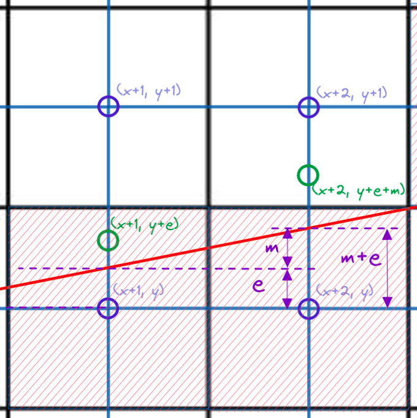

__Figure 11: New error for picking (x+2, y)__

Take note that the error always takes reference from the y coordinate of the currently choosen grid!

With the preceding concepts in place, we are ready to form our pseudocode:
```
#Set error to zero
e = 0 
#Calculate gradient
m = (y2 - y1)/(x2 - x1)

y = y1

FOR x = x1 to x2
    CALL plot(x,y)
    IF ( e + m < 0.5)
        #Increment error by m (error offset taken from y)
        e += m
    ELSE 
        y += 1
        #Increment error by m but error offset taken from y+1
        e += m -1
    END IF
END FOR
```

You can try implementing the above in your favourite programming language, but for now let's try implementing this in Golang! We will choose to draw a 12 pointed star to demonstrate that Brehensam is able to handle all signs and magnitude of gradients:

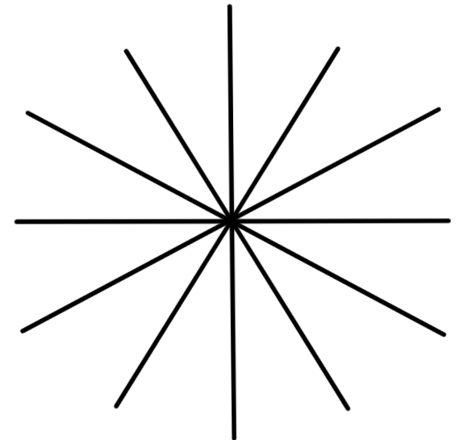

__Figure 12: 12 pointed star__


__Figure 13: 12 pointed star raster attempt__

But wait, what's wrong? Turns out our pseudo code only applies for the second octant, which is highlighted in figure 14. We will need to modify our pseudocode to handle gradients of different magnitude and signs.

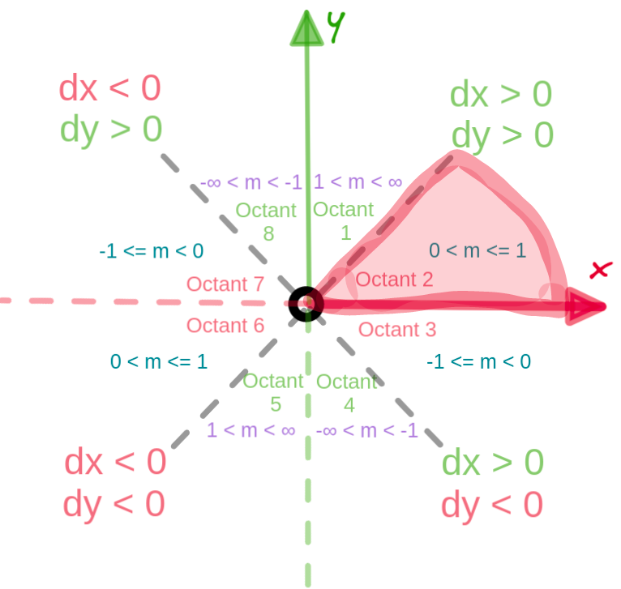

__Figure 14: Octant 2 is highlighted here__


### The 8 Octants
Show diagram for 8 octants
Give pseudocode for each octant


### A slight problem for implementing brehensam for drawing images 
However, we have a slight problem.
Conventionally, image coordinate frames have their origin at the top left, with the x direction being positive towards the right, and y direction towards the bottom.
 
We will need to vertically flip the 8 octants for our model to work

## Can I has a house?

<Show the house I drew>

## What about circles? Can I have them too?

Brehensam has been extended to be drawn for circles too

## Anti-aliasing you say? 

However, some of the issues that Brehensam face is the aliasing effect. The lines appear jagged up close and people do get sick of retro-looking graphics after a while. 

Talk about Wu's algorithm and lead up to next article


## Notes
- Diagrams were made with [excalidraw](https://excalidraw.com/)
- I tried to follow [3] for the pseudocode syntax, if you know of any better pseudocode formats please ping me!
- Please let me know if there are any inconsistencies or misstated facts at john_tanguanzhong@hotmail.com

## References
1. [Brehensam's Line Algorithm Pseudocode](https://www.cs.helsinki.fi/group/goa/mallinnus/lines/bresenh.html)
2. [Paul E. Black. Dictionary of Algorithms and Data Structures, NIST.](https://xlinux.nist.gov/dads/HTML/bresenham.html)


[An Introduction to Writing Good Pseudocode](https://towardsdatascience.com/pseudocode-101-an-introduction-to-writing-good-pseudocode-1331cb855be7)


# CHECKS TO DO

1. Figures
   1. Are they numbered properly?
   2. Are they correct?
   3. Are the descriptions filled up?
2. Table of contents
   1. Are the headings done properly?
3. Crediting
   1. Are all sources credited properly?
   2. 