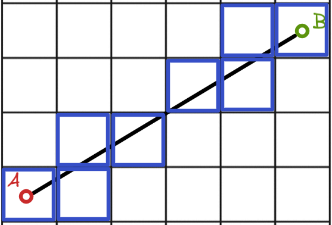
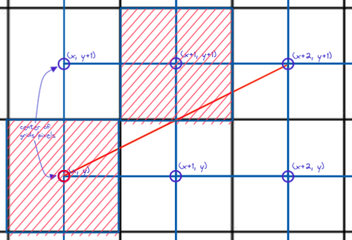
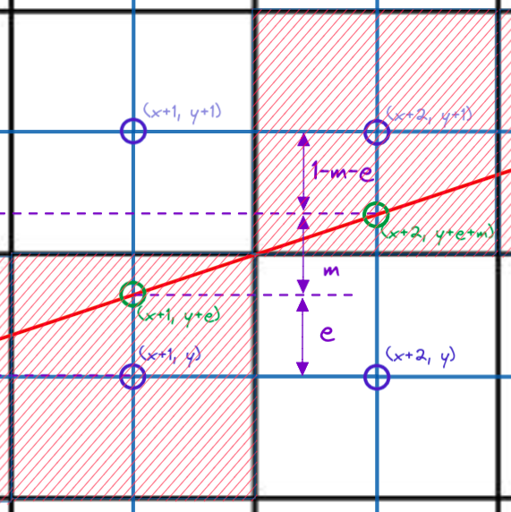
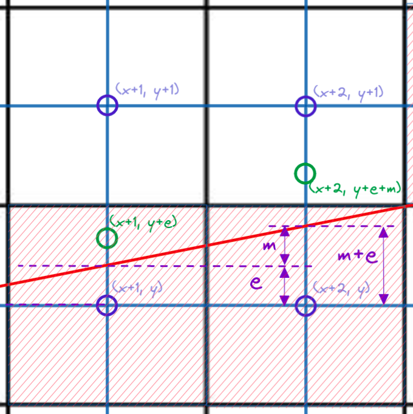

Don't you think its fascinating how lines and circles are rendered on pixels?
I've been wanting to to code from scratch Brehensam line algorithm in Golang. This is the 1st part of a 3 part article that deals with 

# Table of Contents

- [Table of Contents](#table-of-contents)
- [Introduction](#introduction)
- [What's The Problem?](#whats-the-problem)
- [Brehensam Pseudocode and Implementation](#brehensam-pseudocode-and-implementation)
  - [Focusing on Octant 2](#focusing-on-octant-2)
  - [Octant 1 and 5: Gradient values between 1 and INFINITY](#octant-1-and-5-gradient-values-between-1-and-infinity)
  - [The rest of the octants: Dealing With Negativity](#the-rest-of-the-octants-dealing-with-negativity)
  - [Sayonara Floating Points!](#sayonara-floating-points)
- [Runtime Comparism Float and Integer Implementations](#runtime-comparism-float-and-integer-implementations)
- [Conclusion](#conclusion)
- [Notes](#notes)
- [References](#references)
- [CHECKS TO DO](#checks-to-do)

# Introduction

Rasterization turns out to be one of those things that are really old and widely used, yet it is among one of the least understood rendering techniques among most people who rely on it daily (Yes I'm looking at you dear reader). 

Perhaps let's start by describing a problem that Rasterization solves.
We draw a line from a center of one grid (point A) to another (point B). Now on a pixel display, how can we best represent lines between arbitrary points?


__Figure 1: A simple line AB__

Even if we have all the time in the world and choose to manually colorize pixels to achieve the perfectly rasterized line, we might not end up with a set of pixels that best represent the line AB.



__Figure 2: A manual attempt at rasterizing line AB__

Let's compare this to actually using a rasterization algorithm (Brehensam's Line Algorithm). But the question remains: How do we know what if the rasterized result is actually the closest approximation/representation of the actual line? On what mathematical basis can we decide this? 


__Figure 3: Line AB rasterized using Brehensam's Algorithm__


Let's take a look at the Brehensam Line Algorithm, a classic line rasterization algorithm still in great use today. It was developed in 1962 at IBM [2] for a [Calcomp Plotter](https://en.wikipedia.org/wiki/Calcomp_plotter). 

There are plenty of articles out there explaining the Brehensam Line Algorithm and there is a [particular one I like](https://www.cs.helsinki.fi/group/goa/mallinnus/lines/bresenh.html). I think he did a hella good job and I would like to build upon Colin's work and focus on the intuition which will lead us to the algorithm.

Small note: Some articles tend to use the following coordinate frame, taking the top left as the origin (0,0), right as positive x direction, and downwards as the positive y direction.


__Figure 4: Image Coordinate Frame__

To keep it visually intuitive. I will instead use the graph coordinate frame, and not worry about how it will translate to the image coordinate frame for now: 


__Figure 5: Graph Coordinate Frame__

# What's The Problem?

The problem statement is to represent a line from point A (x1, y1) to B (x2, y2) on a grid algorithmicallym, whilst keeping the error between the pixels plotted and the actual line to a minimum. We make the following assumptions:
1. The start and end points coordinate are integers. 
2. We will only be incrementing x as we plot the line. 


__Figure 6: Problem Set up__

Given the following assumption, it suffices to say that we have only 2 possible choices from which to plot. Will it be (x+1, y) in figure 7 or (x+1, y+1) in figure 8?
Brehensam's algorithm will be alternating between these 2 choices for the first octant.


__Figure 7: Pixelize (x+1, y)__



__Figure 8: Or pixelize (x+1, y+1)?__

However, as we start iterating through the algorithm, we will notice that the center of the plotted grid will have an error offset from the ACTUAL line. This is illustrated in figure 9.
```
#x1 and y1 are starting coordinates of the line
x = x1, y = y1

#Iteration 0
Actual line coordinate = (x, y)
Rasterized grid = (x, y)

#Iteration 1
Actual line coordinate = (x, y + e)
Rasterized grid = (x + 1, y)

#Iteration 2
Actual line coordinate = (x, y + e + m)
Rasterized grid = (x + 2, y + 1)

```


__Figure 9: Error offset of y coordinate__

To determine which grid to actually plot on, we have to focus on the difference between the rasterized y coordinate and the actual line y coordinate. In the example above, we will only plot on (x+2, y+1) if:
> **y + e + m >= y + 0.5**

Similarly, we will only plot on (x+2, y) if:
> **y + e + m < y + 0.5**

After plotting on each increment of x, we notice that now the error has changed, and how the error changes depends on whether we pick (x+2, y+1) or (x+2, y).
If we pick (x+2, y+1), the new error is now:
> **e_new** = (y + e_old + m) - (y + 1)
> **e_new** = e_old + m - 1



__Figure 10: New error for picking (x+2, y+1)__

If we pick (x+2, y), the new error is now:
> **e_new** = (y + e_old + m) - (y)
> **e_new** = e_old + m



__Figure 11: New error for picking (x+2, y)__

Take note that the error always takes reference from the y coordinate of the currently choosen grid!

# Brehensam Pseudocode and Implementation

## Focusing on Octant 2

With the preceding concepts in place, we are ready to form our pseudocode:
```
# Set error to zero
e = 0 
# Calculate gradient
m = (y2 - y1)/(x2 - x1)

y = y1

FOR x = x1 to x2
    CALL plot(x,y)
    IF ( e + m < 0.5)
        # Increment error by m (error offset taken from y)
        e += m
    ELSE 
        y += 1
        # Increment error by m but error offset taken from y+1
        e += m -1
    END IF
END FOR
```

__Code Block 1: Brehensam's Line Algorithm for Octant 2 Pseudocode__

You can try implementing the above in your favourite programming language, but for now let's try implementing this in Golang! 

```
//GOLANG IMPLEMENTATION

m := (float64(y2 - y1)) / (float64(x2 - x1)) //calculate gradient

for x, y, err := x1, y1, 0.0; x != x2+1; x += 1 {
    // Plot point (x,y)
    img.Set(x, y, color)
    if (err + m) < 0.5 {
        // Increment error by m (error offset taken from y)
        err += m
    } else {
        y += 1
        // Increment error by m but error offset taken from y+1
        err += m - 1
    }
}

```
__Code Block 2: Code Block 1 implemented in GOLang__

We will choose to draw a 12 pointed star (Figure 12) to demonstrate that Brehensam is able to handle all signs and magnitude of gradients, by passing in the following input, which will be parsed as x1, y1 -> x2, y2
```
8,8 -> 4,0; 
8,8 -> 0,4; 
8,8 -> 12,0;
8,8 -> 16,4;
8,8 -> 16,12;
8,8 -> 12,16;
8,8 -> 4,16;
8,8 -> 0,12;
8,8 -> 8,0;
8,8 -> 0,8;
8,8 -> 8,16;
8,8 -> 16,8;
```
__Code Block 3: Input given to my programme__


__Figure 12: 12 pointed star__

But wait... running our algorithm now will simply put us in an infinite loop where both x and y and incremented, which means that for some lines, (err + m) will always be more than or equal to 0.5 

Turns out our pseudo code only applies for the second octant, which is highlighted in figure 14. Our current algorithm is only able to handle positive gradient values between 1 and 0.


__Figure 14: Octant 2 is highlighted here among the other octants__

## Octant 1 and 5: Gradient values between 1 and INFINITY

Lets solve for the case that we have a positive gradient value between 1 and infinity. There will be a few small changes made to the algorithm:

1. We will need to set the new gradient value as the reciprocal of the actual line gradient.
2. Iterate y from y1 to y2 (Instead of iterating through x)

```
e = 0 
# Calculate reciprocal of gradient
m = (x2 - x1)/(y2 - y1)

x = x1

FOR y = y1 to y2
    CALL plot(x,y)
    IF ( e + m < 0.5)
        e += m
    ELSE 
        x += 1
        e += m -1
    END IF
END FOR
```

__Code Block 4: Brehensam Octant 1 Pseudocode__

## The rest of the octants: Dealing With Negativity

We can use the easy trick of swapping the end and start points of the line, to make the gradient negative, but let's try another way around it.

```
#...

FOR x = x1 to x2
    CALL plot(x,y)
    IF ( e + m > -0.5)
        e += m
    ELSE 
        y += 1
        e += m + 1
    END IF
END FOR
```

__Code Block 5: Brehensam Octant 3 Pseudocode__

This can similarly be applied to gradient values where -INFINITY < m < 1.


Now, we can reduce the pseudocode above to as little lines as possible and implement this in golang:

<details>
<summary> <b> Golang Implementation of Brehensam Float </b> </summary>
<pre>

	dx, dy := x2-x1, y2-y1

	grad_sign := 1.0                  //Sign of gradient
	if bool(dx < 0) != bool(dy < 0) { // (dx is negative) XOR (dy is negative)
		grad_sign = -1.0
	}

	//We use x_inc and y_inc to either increment or decrement x or y depending on the sign of the gradient
	x_inc := line_render.CopySignInt(1, dx)
	y_inc := line_render.CopySignInt(1, dy)

	var m float64
	if dx != 0 { //Only calculate gradient if it is not infinite
		m = (float64(dy)) / (float64(dx)) //gradient
	}
	if line_render.Abs(dy) > line_render.Abs(dx) { // if absolute value of gradient > 1, then invert it
		m = 1 / m
	}

	if dx == 0 && dy == 0 {
		fmt.Printf("Start and end coordinates are the same \n")
		return
	} else if dx == 0 { // m == INF
		for y := y1; y != y2+y_inc; y += y_inc {
			img.Set(x1, y, color)
		}
	} else if dy == 0 { // m == 0
		for x := x1; x != x2+x_inc; x += x_inc {
			img.Set(x, y1, color)
		}
	} else if line_render.Abs(dy) > line_render.Abs(dx) { // 1 < abs(m) < INF
		// fmt.Printf("1st, 5th, 4th and 8th Octant: 1 < abs(m) < INF \n")
		for x, y, err := x1, y1, 0.0; y != y2+y_inc; y += y_inc {
			img.Set(x, y, color)
			if grad_sign*(err+m) < 0.5 {
				err += m
			} else {
				err += m - grad_sign*1
				x += x_inc
			}
		}
	} else { // 0 < abs(m) <= 1
		// fmt.Printf("2nd, 6th, 3rd and 7th Octant: 0 < abs(m) <= 1 \n")
		for x, y, err := x1, y1, 0.0; x != x2+x_inc; x += x_inc {
			img.Set(x, y, color)
			if grad_sign*(err+m) < 0.5 {
				err += m
			} else {
				err += m - grad_sign*1
				y += y_inc
			}
		}
	}
</pre>
</details>

__Code Block 6: Golang Implementation of Brehensam Float__

With this code, we are poised to form our 12 pointed star using the input from Code Block 3.


__Figure 15: 12 Pointed Star Rasterized__

---

## Sayonara Floating Points!

So far everything we have talked about involves floating point operations, but that can be the bane of all evil when it comes to efficiency. So naturally we would want to simplify it to only perform integer based operations. 

The following equations will be further massaged to get rid of the floating point variable m:
> **e + m < 0.5** *(1)*
> 
> **e = e + m** *(2)*
> 
> **e = e + m - 1** *(2)*

For **equation (1)**, we will multiply both sides by dx, where dx = x2 - x1:
> **e + m < 0.5** *(1)*
> 
> (e + m) * dx < 0.5 * dx 
> 
> (e + (dy/dx)) * dx < 0.5 * dx 
> 
> 2*e * dx + 2*dy < dx 
> 
> 2*(e' + dy) < dx (_where e' = e*dx_)
> 
> __e * dx + dy < 0.5 * dx__ *(4)*

For **equation (2)**, we also multiply both sides by dx:
> **e = e + m** *(2)*
> 
> e * dx = (e + m) * dx 
> 
> __e' = e' + dy__ *(5)*

For **equation (3)**, the same thing:
> **e = e + m - 1** *(3)*
> 
> __e' = e' + dy - dx__  *(6)*

Now our new pseudocode for octant 2 becomes:
```
e = 0 
y = y1
dy = y2 - y1
dx = x2 - x1

FOR x = x1 to x2
    CALL plot(x,y)
    IF ( 2(e' + dy) < dx)
        # Increment error by m (error offset taken from y)
        e' += dy
    ELSE 
        y += 1
        # Increment error by m but error offset taken from y+1
        e' += dy - dx
    END IF
END FOR
```
__Code Block 7: Brehensam Integer Version (Octant 2) Pseudocode__

Implementing this in Golang...

<details>
<summary> <b> Golang Implementation of Brehensam Integer Version </b> </summary>
<pre>

    dx, dy := x2-x1, y2-y1

    grad_sign := 1                    //Sign of gradient
    if bool(dx < 0) != bool(dy < 0) { // (dx is negative) XOR (dy is negative)
        grad_sign = -1
    }
    x_inc := line_render.CopySignInt(1, dx)
    y_inc := line_render.CopySignInt(1, dy)

    if dx == 0 && dy == 0 {
        fmt.Printf("Start and end coordinates are the same \n")
        return
    } else if dx == 0 { // m == INF
        for y := y1; y != y2+y_inc; y += y_inc {
            img.Set(x1, y, color)
        }
    } else if dy == 0 { // m == 0
        for x := x1; x != x2+x_inc; x += x_inc {
            img.Set(x, y1, color)
        }
    } else if line_render.Abs(dy) > line_render.Abs(dx) { // 1 < abs(m) < INF
        // fmt.Printf("1st, 5th, 4th and 8th Octant: 1 < abs(m) < INF \n")
        for x, y, err := x1, y1, 0; y != y2+y_inc; y += y_inc {
            img.Set(x, y, color)
            if grad_sign*2*(err+dx) < dy {
                err += y_inc * (dx)
            } else {
                err += y_inc * (dx - (grad_sign * dy))
                x += x_inc
            }
        }
    } else { // 0 < m <= 1
        // fmt.Printf("2nd, 6th, 3rd and 7th Octant: 0 < abs(m) <= 1 \n")
        for x, y, err := x1, y1, 0; x != x2+x_inc; x += x_inc {
            img.Set(x, y, color)
            if grad_sign*2*(err+dy) < dx {
                err += x_inc * (dy)
            } else {
                err += x_inc * (dy - (grad_sign * dx))
                y += y_inc
            }
        }
    }
</pre>
</details>

__Code Block 8: Golang Implementation of Brehensam Integer__

---

Note: If we are going to plot on images, we need to use the image coordinate frames Figure 4 instead of Figure 5. This means that the octant model in Figure 14 will be flipped vertically as shown in Figure 16.


__Figure 16: Flipped Octant model for image coordinate frame__

--- 

# Runtime Comparism Float and Integer Implementations

Now let's do some "dirty" comparism by utilising simple timers in our code segments. 

We shall draw a nice little house (The only one I might be able to afford given the housing situation in Singpoare), and compare the time required to draw it using the integer and floating point version of Brehensam (Code block 6 and 8 respectively).


__Figure 17: Our little Raster House__

TODO: Convert to dropdown

```
0,20 -> 15,5; 1
15,5 -> 30,40; 2
30,40 -> 0,20; 3
0,20 -> 0,80; 4
0,80 -> 30,100; 5
30,100 -> 30,40; 6
30,40 -> 100,35; 7
100,35 -> 100,95; 8
100,95 -> 30,100; 9
100,35 -> 75,0; 10
75,0 -> 15,5; 11
10,87 -> 20,93; door 1
20,93 -> 20,43; door 2
20,43 -> 10,37; door 3
10,37 -> 10,87; door 4
35,80 -> 60,78; window a1
60,78 -> 60,58; window a2
60,58 -> 35,60; window a3
35,60 -> 35,80; window a4
70,77 -> 95,75; window b1
95,75 -> 95,55; window b2
95,55 -> 70,57; window b3
70,57 -> 70,77; window b4
```
__Code Block 9: Input used to draw house__


Upon timing both implementations, we can see that the integer implementation does outperform the float implementation although seemingly not by much, but that might be because we did not use large data input sizes.


__Figure 17: Comparism in elapsed run time between integer and float implementation__

# Conclusion

Although Brehensam's algorithm fast and simple implementation has led to it's importance in many graphics library and even in the firmware of graphics card, there are numerous issues that it is not made to address. 

Namely, there is an aliasing effect for lines drawn using this algorithm. The lines appear jagged up close and people do get sick of retro-looking graphics after a while. This issue is solved by [Xiaolin Wu's Line Algorithm](https://en.wikipedia.org/wiki/Xiaolin_Wu%27s_line_algorithm), which performs anti-alising and handles cases where the endpoints of the line do not lie exactly on integer points of the pixel grid [3]. We will take a look at Wu's algorithm in Part 3.

Secondly, we have not seen how Brehensam's Line Algorithm is able to raster curves, and that will be the focus of Part 2.


# Notes
- The source code for my [Golang rasterization program can be found here](https://github.com/JohnTGZ/Rasterization-GO)
- Diagrams were made with [excalidraw](https://excalidraw.com/)
- I tried to follow [4] for the pseudocode syntax.
- I have been trying to learn markdown formatting properly and [this guide helped me tremendously](https://gist.github.com/apaskulin/1ad686e42c7165cb9c22f9fe1e389558).
- Please let me know if there are any inconsistencies or misstated facts at john_tanguanzhong@hotmail.com

# References
[1] [Brehensam's Line Algorithm Pseudocode](https://www.cs.helsinki.fi/group/goa/mallinnus/lines/bresenh.html)

[2] [Paul E. Black. Dictionary of Algorithms and Data Structures, NIST.](https://xlinux.nist.gov/dads/HTML/bresenham.html)

[3] [Wikipedia Entry for Xiaolin Wu's Line Algorithm](https://en.wikipedia.org/wiki/Xiaolin_Wu%27s_line_algorithm)

[4] [An Introduction to Writing Good Pseudocode](https://towardsdatascience.com/pseudocode-101-an-introduction-to-writing-good-pseudocode-1331cb855be7)


# CHECKS TO DO
1. Figures
   1. Are they numbered properly?
   2. Are they correct?
   3. Are the descriptions filled up?
2. Table of contents
   1. Are the headings done properly?
3. Crediting
   1. Are all sources credited properly?
4. Add section links to reference to own figures and code blocks