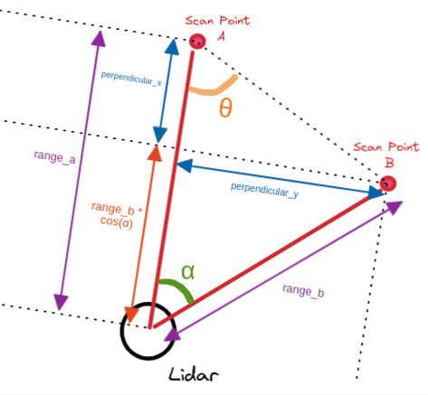
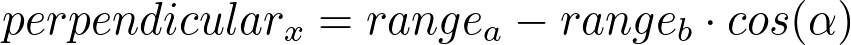
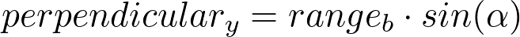
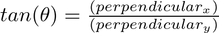
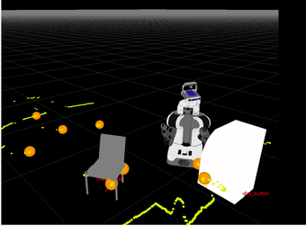

This article is still a work in progress, come back at the end of February 2022 to check it out :)

# Table of Contents

- [Table of Contents](#table-of-contents)
- [Introduction](#introduction)
- [Types of laser filters](#types-of-laser-filters)
  - [LaserScanIntensityFilter](#laserscanintensityfilter)
    - [Use Cases](#use-cases)
    - [Parameters](#parameters)
    - [Pseudocode](#pseudocode)
      - [*Update Function*](#update-function)
  - [LaserScanRangeFilter](#laserscanrangefilter)
    - [Use Cases](#use-cases-1)
    - [Parameters](#parameters-1)
    - [Pseudocode](#pseudocode-1)
      - [*Update Function*](#update-function-1)
  - [LaserScanAngularBoundsFilter](#laserscanangularboundsfilter)
    - [Use Cases](#use-cases-2)
    - [Parameters](#parameters-2)
    - [Pseudocode](#pseudocode-2)
      - [*Update Function*](#update-function-2)
  - [LaserScanAngularBoundsFilterInPlace](#laserscanangularboundsfilterinplace)
    - [Parameters](#parameters-3)
  - [LaserScanSectorFilter](#laserscansectorfilter)
    - [Parameters](#parameters-4)
  - [InterpolationFilter](#interpolationfilter)
    - [Use Cases](#use-cases-3)
    - [Parameters](#parameters-5)
    - [Pseudocode](#pseudocode-3)
      - [*Update Function*](#update-function-3)
  - [LaserScanFootprintFilter](#laserscanfootprintfilter)
    - [Use Cases](#use-cases-4)
    - [Parameters](#parameters-6)
    - [Pseudocode](#pseudocode-4)
      - [*Update Function*](#update-function-4)
      - [*indexChannel Function*](#indexchannel-function)
      - [*inFootprint Function*](#infootprint-function)
  - [LaserScanBoxFilter](#laserscanboxfilter)
    - [Use Cases](#use-cases-5)
    - [Parameters](#parameters-7)
    - [Pseudocode](#pseudocode-5)
      - [*Update Function* : Updates each laser scan message](#update-function--updates-each-laser-scan-message)
      - [*inBox Function* : Checks if scan point is within 3D cartesian box](#inbox-function--checks-if-scan-point-is-within-3d-cartesian-box)
  - [LaserScanPolygonFilter](#laserscanpolygonfilter)
    - [Use Cases](#use-cases-6)
    - [Parameters](#parameters-8)
    - [Pseudocode](#pseudocode-6)
      - [*Update Function*](#update-function-5)
      - [*inPolygon Function* : Checks if scan point is within 2D polygon](#inpolygon-function--checks-if-scan-point-is-within-2d-polygon)
  - [LaserScanMaskFilter](#laserscanmaskfilter)
    - [Parameters](#parameters-9)
    - [Pseudocode](#pseudocode-7)
      - [*Update Function*](#update-function-6)
  - [ScanShadowsFilter](#scanshadowsfilter)
    - [Parameters](#parameters-10)
    - [Pseudocode](#pseudocode-8)
      - [*Update Function*](#update-function-7)
      - [*isShadow Function*](#isshadow-function)
      - [Visual Explaination](#visual-explaination)
  - [ScanBlobFilter](#scanblobfilter)
    - [Parameters](#parameters-11)
    - [Pseudocode](#pseudocode-9)
      - [*Update Function*](#update-function-8)
  - [LaserScanSpeckleFilter](#laserscanspecklefilter)
    - [Parameters](#parameters-12)
    - [Pseudocode](#pseudocode-10)
      - [*Update Function*](#update-function-9)
      - [*checkWindowValid Function (Distance)*](#checkwindowvalid-function-distance)
      - [*checkWindowValid Function (Radius outlier)*](#checkwindowvalid-function-radius-outlier)
  - [pass_through filter](#pass_through-filter)
- [Afterthoughts](#afterthoughts)
- [Notes](#notes)
- [References](#references)

# Introduction

Today, I want to help illuminate the filtering algoritms used in the laser_filters package through pseudocode, demonstrating their use cases and through visual diagrams. I also hope to fill in some gaps that have been left by existing documentation on ROS Wiki.

This is written especially for ROS Beginners(and might not understand C++ as well), as well as for those who are simply interested but too busy to read the source code.
By the way, if you [haven't read the documentation](http://wiki.ros.org/laser_filters), it will be immensely useful. Although it hasn't been updated to include new filters from the latest branch.

When I was starting out in ROS, I wondered how ROS developers wrote their own algorithms for filtering lidar noise, or getting the specific data points they desire. And the open source community already had an answer to that, the [ros-perception laser_filters package](https://github.com/ros-perception/laser_filters) is already an essential tool that relieves every other ROS developer out there from having to develop their own lidar processing code. 

However, it's a pity that for such an awesome piece of work, there is insufficient documentation and material out there explaining how these algorithms work. Of course most experienced developers would say, "Read the source code! It's really obvious." But we fail to see that engineers can be too busy to deep dive into the code even if the code is well organized and written (which it just so happens often). 

# Types of laser filters
Laser scans encode 2 primary types of data, the range of each laser beam and it's reflected intensity. By comparing the ranges between different laser beams we can also remove "noisy" laser beams. We can also convert the laser scans to it's corresponding (x, y) position relative to the robot (or obtain their angular position) and filter out points in undesired locations, with the possibility to also invert this operation.
The types of manipulation performed on the laser scan ranges could be setting their value to NaN, Infinity or a user-defined value.

In the following pseudocode, the **Update Function** is the main function that manipulates laser scans within each laser filter.

## LaserScanIntensityFilter
This filter removes all measurements from the sensor_msgs/LaserScan which have an intensity greater than upper_threshold or less than lower_threshold. These points are "removed" by setting the corresponding range value to range_max + 1, which is assumed to be an error case.

Take note that setting **filter_override_intensity** to true will assign all "removed" points the intensity of 0.0, and all non-"removed" points to have an intensity value of 1.0 .

  ### Use Cases
The intensity filter could be used to extract laser scan points within a range of intensities especially for applications in robot docking, or even SLAM. Some docking stations possess reflective markers which the lidar will perceive as high intensity scan points, which when extracted and processed could provide an indication of the angular and linear offset of the robot relative to the docking station.


  ### Parameters
```yaml
- name: intensity
  type: laser_filters/LaserScanIntensityFilter
  params:
    lower_threshold: 8000 
    upper_threshold: 100000
    invert: false
    filter_override_range: true #If true, set all "removed" points to NaN
    filter_override_intensity: false #If true, set all "removed" points to have intensity of 0.0, and set all non-"removed" points to have intensity of 1.0
```

  ### Pseudocode

  #### *Update Function*
  [Source Code](https://github.com/ros-perception/laser_filters/blob/c25f2f738b33f322ffb3bb52f2dc01d74688b233/src/intensity_filter.cpp#L66-L106)
```python 
FUNCTION Update(scan)

  for each i in RANGE (0, scan.ranges.size()) # For each laser scan point
    #Intensity and range are modified in place here
    intensity = scan.intensities[i]
    range = scan.ranges[i]
    
    #Set filter as true if intensity falls outside the user-defined threshold
    filter = intensity <= config.LOWER_THRESHOLD OR intensity >= config.UPPER_THRESHOLD
    if (config.INVERT) #Invert "removal" of points
      filter = not filter
    end if

    if filter
      if config.filter_override_range
        range = NaN #Set current range value as NaN
      end if

      if config.filter_override_intensity
        intensity = 0.0 
      end if 
    else 
      if config.filter_override_intensity
        intensity = 1.0 
      end if
    end if   
  end for

ENDFUNCTION
```

## LaserScanRangeFilter
This filter removes all measurements from the sensor_msgs/LaserScan which are greater than upper_threshold or less than lower_threshold. 

  ### Use Cases
The range filter could be used to "remove" laser scan points that are below or beyond the usable lidar range (usually defined in the technical datasheet of the lidar). This is important to prevent erroneous readings from being used in the marking/clearing of obstacles from the costmap of the navigation stack.

  ### Parameters
```yaml
- name: range_filter
  type: laser_filters/LaserScanRangeFilter
  params:
    use_message_range_limits: false   # If false, use the threshold specified here, else use the range limits in the scan message
    lower_threshold: 0.075            # if not specified defaults to 0.0
    upper_threshold: 24.0             # if not specified defaults to 100000.0
    lower_replacement_value: .inf     # Replacement value for scans below lower_threshold, if not specified defaults to NaN
    upper_replacement_value: .inf     # Replacement value for scans above upper_threshold, if not specified defaults to NaN
```

  ### Pseudocode

  #### *Update Function*
  [Source Code](https://github.com/ros-perception/laser_filters/blob/c25f2f738b33f322ffb3bb52f2dc01d74688b233/include/laser_filters/range_filter.h#L82-L110)
```python 
FUNCTION Update(scan_in, scan_out)

  lower_threshold = config.lower_threshold
  upper_threshold = config.upper_threshold

  if (config.use_message_range_limits)
    lower_threshold = scan_in.range_min
    upper_threshold = scan_in.range_max
  end if
  
  scan_out = scan_in #Copy input scans to output scans

  for i in range(0, scan_in.ranges.size()) # For each laser scan point
    #Assign replacement values for scan ranges outside the specified threshold
    if (scan_out.ranges[i] <= lower_threshold)
      scan_out.ranges[i] = config.lower_replacement_value
    else if (scan_out.ranges[i] >= upper_threshold)
      scan_out.ranges[i] = config.upper_replacement_value
    end if

  end for

ENDFUNCTION
```

## LaserScanAngularBoundsFilter
Removes points in a [sensor_msgs/LaserScan](http://docs.ros.org/en/api/sensor_msgs/html/msg/LaserScan.html) OUTSIDE of certain angular bounds by changing the minimum and maximum angle. All angular units are in radians.

  ### Use Cases
The angular bounds filter could be used to remove scan points that might be intersecting with the physical robot base, which are mistaken as obstacles by the navigation stack.

  ### Parameters
```yaml
- name: angular_bounds
  type: laser_filters/LaserScanAngularBoundsFilter
  params:
    lower_angle: -1.571 
    upper_angle: 1.571 
```

  ### Pseudocode

  #### *Update Function*
  [Source Code](https://github.com/ros-perception/laser_filters/blob/c25f2f738b33f322ffb3bb52f2dc01d74688b233/include/laser_filters/angular_bounds_filter.h#L66-L146)
```python 
FUNCTION Update(scan_in, scan_out)
  scan_out = scan_in #Copy input scans to output scans

  start_angle = scan_in.angle_min
  current_angle = scan_in.angle_min

  start_time = scan_in.header.stamp
  count = 0

  for i in range(0, scan_in.ranges.size()) # For each laser scan point
    if scan_in.angle_increment > 0 #If lidar turns counter-clockwise
      #If starting angle is outside the specified angular bounds, then increment the range index until it is within.
      if start_angle < config.lower_angle 
        start_angle += scan_in.angle_increment
        current_angle += scan_in.angle_increment
        start_time += scan_in.time_increment
      else 
        scan_out.ranges[count] = scan_in.ranges[i]
  
        #Don't update intensity data if it's not available
        if scan_in.intensities.size() > i
          scan_out.intensities[count] = scan_in.intensities[i]
        end if

        count++ #Increment index of scan_out

        #Break out of loop if next increment is beyond the upper angular bounds
        if current_angle + scan_in.angle_increment > upper_angle
          break
        end if
        
        current_angle += scan_in.angle_increment
      end if

    else #Lidar turns clockwise
      #If starting angle is outside the specified angular bounds, then increment the range index until it is within.
      if start_angle > config.upper_angle 
        start_angle += scan_in.angle_increment
        current_angle += scan_in.angle_increment
        start_time += scan_in.time_increment
      else 
        scan_out.ranges[count] = scan_in.ranges[i]
  
        #Don't update intensity data if it's not available
        if scan_in.intensities.size() > i
          scan_out.intensities[count] = scan_in.intensities[i]
        end if

        count++ #Increment index of scan_out

        #Break out of loop if next increment is beyond the upper angular bounds
        if current_angle + scan_in.angle_increment < lower_angle
          break
        end if
        
        current_angle += scan_in.angle_increment
      end if
    end if
  end for

  #Assign the fields for metadata of the scans
  scan_out.header.frame_id = scan_in.header.frame_id
  scan_out.header.stamp = start_time
  scan_out.angle_min = start_angle
  scan_out.angle_max = current_angle
  scan_out.angle_increment = scan_in.angle_increment
  scan_out.time_increment = scan_in.time_increment
  scan_out.scan_time = scan_in.scan_time
  scan_out.range_min = scan_in.range_min
  scan_out.range_max = scan_in.range_max

  #Resize output scan to the reduced size after filtering
  scan_out.ranges.resize(count)
  if(scan_in.intensities.size() >= count)
    scan_out.intensities.resize(count)


ENDFUNCTION
```
****

## LaserScanAngularBoundsFilterInPlace
Works in a similar way to LaserScanAngularBoundsFilter. It removes points in a sensor_msgs/LaserScan INSIDE certain angular bounds by changing the minimum and maximum angle. 

  ### Parameters
```yaml
- name: angular_bounds
  type: laser_filters/LaserScanAngularBoundsFilterInPlace
  params:
    lower_angle: -1.571 
    upper_angle: 1.571 
```

## LaserScanSectorFilter
Removes laser scan points within a sector. This would be equivalent to using both LaserScanAngularBoundsFilter and LaserScanRangeFilter together.

  ### Parameters
```yaml
- name: scan_filter
  type: laser_filters/LaserScanSectorFilter
  params:
    angle_min: 2.54                     # if not specified defaults to 0.0
    angle_max: -2.54                    # if not specified defaults to 0.0
    range_min: 0.2                      # if not specified defaults to 0.0
    range_max: 2.0                      # if not specified defaults to 100000.0
    clear_inside: true                  # if not specified defaults to true
    invert: false                       # (!clear_inside) if not specified defaults to false
```

## InterpolationFilter
For any invalid scan range outside of the minimum and maximum scan range, the interpolation comes up with a range value which is an interpolation between the surrounding valid values (within the accepted scan range).

  ### Use Cases
The interpolation filter is sort of a double-edged sword, it could reconstruct scan messages from invalid points. However, it can also introduce unnecessary noise into the scan messages especially if the difference between the surrounding valid range values are relatively large, which is likely for nearby obstacles against other obstacles further away. The navigation stack could mistake this interpolated point as an obstacle when there is none.
I would imagine that it's best used in an environment small enough to be within the maximum range of the lidar.

  ### Parameters
```yaml
- name: interpolation
  type: laser_filters/InterpolationFilter
```

  ### Pseudocode

  #### *Update Function*
  [Source Code](https://github.com/ros-perception/laser_filters/blob/c25f2f738b33f322ffb3bb52f2dc01d74688b233/include/laser_filters/interpolation_filter.h#L63-L110)
```python 
FUNCTION Update(scan_in, scan_out)

  previous_valid_range = scan_in.range_max - 0.01
  next_valid_range = scan_in.range_max - 0.01

  scan_out = scan_in #Copy input scans to output scans

  WHILE i < scan_in.ranges.size() #Iterate through all the scan points 

    #If scan is outside accepted range
    if scan_out.ranges[i] <= scan_in.range_min OR scan_out.ranges[i] >= scan_in.range_max 
      #Find the next valid range reading
      j = i + 1
      start_idx = i
      end_idx = i
      WHILE (j < scan_in.ranges.size())

        #If scan is outside accepted range
        if (scan_out.ranges[j] <= scan_in.range_min OR scan_out.ranges[j] >= scan_in.range_max) 
          #Set the end index of the invalid ranges
          end_idx = j
        else
          #Break out of while loop when a valid range is found
          next_valid_range = scan_out.ranges[j]
          break
        end if
        
        j++
      ENDWHILE

      #Take average of 2 valid range values
      average_range = (previous_valid_range + next_valid_range) / 2.0

      #Assign averaged value to all invalid ranges between the valid values
      for k in range(start_index, end_index)
        scan_out.ranges[k] = average_range
      end for

      #Update previous valid range reading
      previous_valid_range = next_valid_range
      i = j + 1
    
    else
      previous_valid_range = scan_out.ranges[i]
      i++

    end if

  ENDWHILE

ENDFUNCTION
```

## LaserScanFootprintFilter
Removes laser scan points within a prescribed radius of the robot footprint.

  ### Use Cases
The range filter could be used to "remove" laser scan points within the physical robot footprint, especially if the lidar scan points intersect with the robot chassis.

  ### Parameters
```yaml
- name: footprint_filter
  type: laser_filters/LaserScanFootprintFilter
  params:
    inscribed_radius: 0.75
```

  ### Pseudocode
The footprint filter is one of those filters that first convert the laser scans to (x, y) cartesian space before "removing" points.

  #### *Update Function*
  [Source Code](https://github.com/ros-perception/laser_filters/blob/c25f2f738b33f322ffb3bb52f2dc01d74688b233/include/laser_filters/footprint_filter.h#L75-L110)
```python 
FUNCTION Update(scan_in, scan_out)

  scan_out = scan_in #Copy input scans to output scans

  #Transform input laser scan (scan_in) to point cloud (laser_cloud) with the frame of "base_link"
  projector_.transformLaserScanToPointCloud("base_link", scan_in, laser_cloud, tf_) # tf_ here is the tf::TransformListener 

  #Get the index of the "index" channel which contains an array that matches each scan point to the index of the laser scan, the array can be accessed via scan_cloud.channels[c_idx].values
  c_idx = indexChannel(laser_cloud)

  #If the "index" channel does not exist or is empty, then ignore scan
  if c_idx == -1 OR laser_cloud.channels[c_idx].values.size() == 0
    return False
  end if

  #Iterate through each laser point cloud
  for i in range(0, laser_cloud.points.size())
    #If point cloud is within the footprint, then "remove" it by setting to NaN
    if (inFootprint(laser_cloud.points[i]))
      #Obtain the laser scan index that corresponds to the point cloud
      index = laser_cloud.channels[c_idx].values[i]
      scan_out.ranges[index] = NaN
    end if
  end for

  up_and_running_ = True

ENDFUNCTION
```

  #### *indexChannel Function*
  [Source Code](https://github.com/ros-perception/laser_filters/blob/c25f2f738b33f322ffb3bb52f2dc01d74688b233/include/laser_filters/footprint_filter.h#L112-L123)
```python
FUNCTION indexChannel(scan_cloud)
  c_idx = -1
  # Iterate through the channels array until an "index" channel is found
  for d in range(0, scan_cloud.channels.size())
    # This "index" channel contains an array that matches each scan point to the index of the laser scan, the array can be accessed via scan_cloud.channels[c_idx].values
    if scan_cloud.channels[d].name == "index"
      c_idx = d
      break
    end if
  end for

  return c_idx
ENDFUNCTION
```

  #### *inFootprint Function*
  [Source Code](https://github.com/ros-perception/laser_filters/blob/c25f2f738b33f322ffb3bb52f2dc01d74688b233/include/laser_filters/footprint_filter.h#L125-L129)
```python
FUNCTION inFootprint(scan_pt)
  #Get flags on whether the individual x or y coordinates are within the footprint radius
  x_a = scan_pt.x < -1.0 * config.inscribed_radius
  x_b = scan_pt.x > config.inscribed_radius
  y_a = scan_pt.y < -1.0 * config.inscribed_radius
  y_b = scan_pt.y > config.inscribed_radius

  #If the (x,y) point is outside the footprint
  if x_a OR x_b OR y_a OR y_b
    return False
  end if

  return True
ENDFUNCTION
```


## LaserScanBoxFilter
This filter removes points in a sensor_msgs/LaserScan inside of a 3 dimensional cartesian box.
These points are "removed" by setting the corresponding range value to NaN which is assumed to be an error case.

  ### Use Cases
The range filter could be used to "remove" laser scan points within the physical robot footprint, especially if the lidar scan points intersect with the robot chassis.

  ### Parameters
```yaml
- name: box_filter
  type: laser_filters/LaserScanBoxFilter
  params:
    box_frame: base_link
    max_x: 0.5
    max_y: 0.5
    max_z: 0.5
    min_x: -0.5
    min_y: -0.5
    min_z: -0.5
    invert: false #sets either the points inside or outside the defined box to be NaN
``` 

  ### Pseudocode

  #### *Update Function* : Updates each laser scan message
  [Source Code](https://github.com/ros-perception/laser_filters/blob/c25f2f738b33f322ffb3bb52f2dc01d74688b233/src/box_filter.cpp#L105-L199)
  
```python 
FUNCTION Update(scan_in, scan_out)

  scan_out = scan_in #Copy input scans to output scans

  #Wait for transform from config.box_frame to scan_in frame to be available, using tf_.waitForTransform(...)

  #Transform input laser scan (scan_in) to point cloud (laser_cloud), with the point cloud having frame_id of the user-defined box_frame
  # tf_ here is the tf::TransformListener 
  projector_.transformLaserScanToPointCloud(config.box_frame, scan_in, laser_cloud, tf_) 

  # Obtain field indexes for the point cloud index, x, y and z fields
  # They match each scan point to the index of each laser scan
  i_idx_c = sensor_msgs::getPointCloud2FieldIndex(laser_cloud, "index") 
  x_idx_c = sensor_msgs::getPointCloud2FieldIndex(laser_cloud, "x") 
  y_idx_c = sensor_msgs::getPointCloud2FieldIndex(laser_cloud, "y")
  z_idx_c = sensor_msgs::getPointCloud2FieldIndex(laser_cloud, "z")

  #Ignore scan if any of the required fields do not exist
  if i_idx_c == -1 OR x_idx_c == -1 OR y_idx_c == -1 OR z_idx_c == -1
    return False
  end if

  # Get offset from start of point struct, used as starting index
  i_idx_offset = laser_cloud.fields[i_idx_c].offset 
  x_idx_offset = laser_cloud.fields[x_idx_c].offset
  y_idx_offset = laser_cloud.fields[y_idx_c].offset
  z_idx_offset = laser_cloud.fields[z_idx_c].offset

  pstep = laser_cloud.point_step #Length of a point in bytes
  pcount = laser_cloud.width * laser_cloud.height #Number of counts
  limit = pstep * pcount #Maximum byte length

  #Set starting index to that of the offset
  i_idx = i_idx_offset
  x_idx = x_idx_offset
  y_idx = y_idx_offset
  z_idx = z_idx_offset

  #Iterate through the points until the end
  for x_idx < limit

    x = laser_cloud.data[x_idx]
    y = laser_cloud.data[y_idx]
    z = laser_cloud.data[z_idx]
    index = laser_cloud.data[i_idx]

    point = tf::Point(x, y, z)

    #If not inverting, then simply "remove" points within the 3d cartesian box
    #Else "remove" points outside the box
    if not config.invert 
      if inBox(point)
        output_scan.ranges[index] = NaN
      end if
    else
      if not inBox(point)
        output_scan.ranges[index] = NaN
      end if
    end if

    #Step through to next index
    i_idx += pstep
    x_idx += pstep
    y_idx += pstep
    z_idx += pstep

  end for

  up_and_running_ = True

  return True

ENDFUNCTION
```

  #### *inBox Function* : Checks if scan point is within 3D cartesian box
  [Source Code](https://github.com/ros-perception/laser_filters/blob/c25f2f738b33f322ffb3bb52f2dc01d74688b233/src/box_filter.cpp#L201-L206)

```python
FUNCTION inBox(point)
  #Flags to indicate if each point coordinate is within the defined box limits
  a = point.x < config.max_x
  b = point.x > config.min_x
  c = point.y < config.max_y
  d = point.y > config.min_y
  e = point.z < config.max_z
  f = point.z > config.min_z

  #Return true if within box limits
  return a AND b AND c AND d AND e AND f

ENDFUNCTION
```

## LaserScanPolygonFilter
"Removes" laser scan points within a user-defined polygon using a method similar to LaserScanBoxFilter.
The example parameters below define a five sided polygon.


  ### Use Cases
The range filter could be used to "remove" laser scan points within the physical robot footprint, especially if the lidar scan points intersect with the robot chassis.

  ### Parameters
```yaml
- name: polygon_filter
  type: laser_filters/LaserScanPolygonFilter
  params:
    polygon_frame: base_link
    polygon: [[-1.0, 0.5], [0, 1.0], [1.0, 0.5], [1.0, 0.5], [0.5, -1.0]]
    invert: false #sets either the points inside or outside the defined polygon to be NaN
```

  ### Pseudocode

  #### *Update Function*
  [Source Code](https://github.com/ros-perception/laser_filters/blob/c25f2f738b33f322ffb3bb52f2dc01d74688b233/src/polygon_filter.cpp#L483-L547)

```python 
FUNCTION Update(scan_in, scan_out)

  #Publish polygon message for visualization

  scan_out = scan_in #Copy input scans to output scans
  
  #Wait for transform from config.polygon_frame to scan_in frame to be available, using tf_.waitForTransform(...)
  success = tf_.waitForTransform(...)

  if not success
    return False
  end if 

  #Transform input laser scan (scan_in) to point cloud (laser_cloud), with the point cloud having frame_id of the user-defined polygon_frame
  # tf_ here is the tf::TransformListener 
  projector_.transformLaserScanToPointCloud(config.polygon_frame, scan_in, laser_cloud, tf_) 

  # Obtain field indexes for the point cloud index, x, y and z fields
  # They match each scan point to the index of each laser scan
  i_idx_c = sensor_msgs::getPointCloud2FieldIndex(laser_cloud, "index") 
  x_idx_c = sensor_msgs::getPointCloud2FieldIndex(laser_cloud, "x") 
  y_idx_c = sensor_msgs::getPointCloud2FieldIndex(laser_cloud, "y")
  z_idx_c = sensor_msgs::getPointCloud2FieldIndex(laser_cloud, "z")

  #Ignore scan if any of the required fields do not exist
  if i_idx_c == -1 OR x_idx_c == -1 OR y_idx_c == -1 OR z_idx_c == -1
    return False
  end if

  # Get offset from start of point struct, used as starting index
  i_idx_offset = laser_cloud.fields[i_idx_c].offset 
  x_idx_offset = laser_cloud.fields[x_idx_c].offset
  y_idx_offset = laser_cloud.fields[y_idx_c].offset
  z_idx_offset = laser_cloud.fields[z_idx_c].offset

  pstep = laser_cloud.point_step #Length of a point in bytes
  pcount = laser_cloud.width * laser_cloud.height #Number of counts
  limit = pstep * pcount #Maximum byte length

  #Set starting index to that of the offset
  i_idx = i_idx_offset
  x_idx = x_idx_offset
  y_idx = y_idx_offset
  z_idx = z_idx_offset

  #Iterate through the points until the end
  for x_idx < limit

    x = laser_cloud.data[x_idx]
    y = laser_cloud.data[y_idx]
    z = laser_cloud.data[z_idx]
    index = laser_cloud.data[i_idx]

    point = tf::Point(x, y, z)

    #If not inverting, then simply "remove" points within the 2d polygon
    #Else "remove" points outside the 2d polygon
    if not config.invert 
      if inPolygon(point)
        output_scan.ranges[index] = NaN
      end if
    else
      if not inPolygon(point)
        output_scan.ranges[index] = NaN
      end if
    end if

    #Step through to next index
    i_idx += pstep
    x_idx += pstep
    y_idx += pstep
    z_idx += pstep

  end for

  return True

ENDFUNCTION
```

  #### *inPolygon Function* : Checks if scan point is within 2D polygon
  [Source Code](https://github.com/ros-perception/laser_filters/blob/c25f2f738b33f322ffb3bb52f2dc01d74688b233/src/polygon_filter.cpp#L295-L307)

This function uses ray casting to check if the point is within the polygon. Refer to the [last C code block](https://www.eecs.umich.edu/courses/eecs380/HANDOUTS/PROJ2/InsidePoly.html) (by Randolph Franklin) in Solution 1

```python
FUNCTION inPolygon(point)
  #Flags to indicate if each point coordinate is within the defined polygon limits
  in_polygon = False
  poly_pts = polygon_.points #polygon_.points is the points of the 2d polygon
  j = poly_pts.size() - 1 

  #Iterate through each polygon point
  for each i in range (0, poly_pts.size())
    pt_i = poly_pts[i]
    pt_j = poly_pts[j]
    #flag_a is TRUE if and ONLY if the y coordinate of the scan point is between pt_i.y and  pt_j.y
    flag_a = (pt_i.y > point.y) != (pt_j.y > point.y)
    #Assume we extend a horizontal ray in the positive x direction.
    #flag_B is TRUE if and ONLY if the x intersect of the ray is to the right of the scan point
    flag_b = point.x < (pt_j.x - pt_i.x) * (point.y - pt_i.y) / (pt_j.y - pt_i.y) + pt_i.x

    if flag_a AND flag_b
      in_polygon = not in_polygon
    end if

    j = i
    i++

  end for

  return in_polygon
ENDFUNCTION
```


## LaserScanMaskFilter
Removes scan points by specifying their indexes.

  ### Parameters
```yaml
- name: mask_filter
  type: laser_filters/LaserScanMaskFilter
  params:
    masks:
      <laser1_frameid>:
      - 100
      - 101
      - 102
      - 103
      - 104
      - 1000
      - 1001
      - 1002
      <laser1_frameid>:
      - [200, 201, 203]
      - ...
```

  ### Pseudocode

  #### *Update Function*
  [Source Code](https://github.com/ros-perception/laser_filters/blob/c25f2f738b33f322ffb3bb52f2dc01d74688b233/include/laser_filters/scan_mask_filter.h#L105-L125)
```
FUNCTION Update(scan)
  mask = masks["laser_frameid"]

  for idx in mask
      if idx > idx_array.length: 
          CONTINUE
      end if
      scan.ranges[idx] = NaN
  end for
```

It would be nice to be able to state a range, rather than having to explicitly write each index.

## ScanShadowsFilter
Background: “Laser scans sometimes hit objects at a grazing angle, resulting in “split pixels” or “shadows”. These laser hits show up in the scan as single points in the middle of space, part-way between the object they grazed and a background object. For many tasks such as object model fitting, these points are simply noise and should be removed using the scan shadows filter. [2]

https://answers.ros.org/question/239454/whats-the-rational-behind-laser_filtersscanshadowsfilter/

  ### Parameters

Example config parameters taken from [here](https://github.com/uos/calvin_robot/blob/93b506a10c6fb8000517ebd09c9f7041e2ab9cbf/calvin_bringup/config/calvin_lms200_self_filter.yaml)
```yaml
- name: shadows
  type: laser_filters/ScanShadowsFilter
  params:
    min_angle: 10    # Minimum perpendicular angle (Value range: 0 to 90 degrees)
    max_angle: 170  # Maximum perpendicular angle (Value range: 90 to 180 degrees)
    neighbors: 1      # No. of neighbouring points to remove
    window: 1         # Window of measurements to check 
```

  ### Pseudocode

  #### *Update Function* 
  [Source Code](https://github.com/ros-perception/laser_filters/blob/c25f2f738b33f322ffb3bb52f2dc01d74688b233/src/scan_shadows_filter.cpp#L129-L172)
```python
FUNCTION Update(scan)

  for each i in RANGE (0, scan.size()) # For each point in laser scan
    for y in RANGE( -config.WINDOW, config.WINDOW) 
      if (y == 0)
        CONTINUE
      end if

      #Here we take 2 lidar rays within a window and calculate the angle formed 
      #by the intersection of ray A to ray B and the lidar to ray A,
      #Please refer to the visual explaination below 
      range_a = scan.ranges[i]
      range_b = scan.ranges[i + y]

      #In the source code, the cos/sin of an angle between 2 rays
      #is actually pre-calculated and stored in a look-up table
      angle = getAngleBetween(scan.ranges[i], scan.ranges[i + y]) 
      sin_alpha = sin(angle)
      cos_alpha = cos(angle)
      
      #Check if ray a is a shadow point
      if isShadow(range_a, range_b, sin_alpha, cos_alpha) 

        for index in RANGE (i - config.NEIGHBOURS, i + config.NEIGHBOURS) #For each neighbouring point
          if scan.ranges[i] < scan.ranges[index] 
            scan[index] = NaN
          end if
        end for

        if remove_shadow_start_point_ 
          scan[i] = NaN
        end if

      end if
      
    end for
  end for
  
ENDFUNCTION
```

  #### *isShadow Function*
  [Source Code](https://github.com/ros-perception/laser_filters/blob/c25f2f738b33f322ffb3bb52f2dc01d74688b233/src/scan_shadow_detector.cpp#L64-L81)
```python
# range_a and range_b are the absolute scan distances of P1 and P2 respectively
FUNCTION isShadow(range_a, range_b, sin_alpha, cos_alpha)
  perpendicular_y = range_b * sin_alpha
  perpendicular_x = range_a - range_b * cos_alpha

  #Calculate the angle formed by the intersection of ray A to ray B and the lidar to ray A,
  #Please refer to the visual explaination below 
  perpendicular_tan = ABS(perpendicular_y) / perpendicular_x

  #If this angle is not within user-defined range, 
  # then it is a "shadow" point
  if (perpendicular_tan > 0)
    if (perpendicular_tan < tan(config.MIN_ANGLE)) 
      return True
    end if
  else
    if (perpendicular_tan > tan(config.MAX_ANGLE)) 
      return True
    end if
  end if
  
  return False

ENDFUNCTION
```

  #### Visual Explaination

  We would like to obtain the angle THETA, which is formed by the intersection of scan point A to B and the lidar to scan point A. The angle THETA provides us with information about how relatively far apart are the 2 objects (A and B) seen by the lidar. The calculations to get there is shown below:

  

  __Figure X: Shadow Filter Visual Explaination__

  

  

  


## ScanBlobFilter
The scan blob filter is useful for extracting “blob objects” which means that racks, human legs can be detected effectively (at close distances).
<!-- Ideally, it should be used after being filtered with shadow filters as the filter works by identifying group of points separated by nan values -->
The minimum points and maximum radius must be tuned so that we only obtain blobs of our desired objects and exclude others. For example, you want to only extract chair legs and not human legs, you would specify a smaller *max_radius* and smaller *min_points*.

*Important Note* : This filter is used after the ScanShadowsFilter, as it assumes that each blob would be separated by invalid scan data (Either NaN or Negative range value)



__Figure X: [Scan Blob Visualization](https://github.com/ros-perception/laser_filters/pull/80) __

  ### Parameters
```yaml
- name: blob_filter
  type: laser_filters/ScanBlobFilter
  params:
    max_radius: 0.25 # maximum radius to be considered as blob object
    min_points: 4 # min scan points to be considered as blob object
```

  ### Pseudocode

  #### *Update Function*
  [Source Code](https://github.com/ros-perception/laser_filters/blob/c25f2f738b33f322ffb3bb52f2dc01d74688b233/include/laser_filters/scan_blob_filter.h#L93-L151)

```python 
FUNCTION Update(scan_in, scan_out)

  scan_out = scan_in #Copy input scans to output scans

  std::set<int> indices_to_publish #The scan indices that will represent the blobs, std::set guarantees that each index is unique i.e. no duplicate indices

  range_blob = [] #A blob: an array of scan indexes representing 1 blob
  range_blobs = [[]] #An array of blobs

  #Iterate through the laser scan points
  for each i in range(0, scan_in.ranges.size())
    #First, set all ranges to invalid (negative values)
    scan_out.ranges[i] = -1.0 * fabs(scan_in.ranges[i])
    
    #The moment an invalid range data is encountered, 
    #If the number of scan points in the blob > user-defined minimum points
    #defined by user, then add the blob to range_blobs array
    if scan_in.ranges[i] < 0 || isNaN(scan_in.ranges[i])
      if range_blob.size() > config.min_points
        range_blobs.push_back(range_blob)
      end if
      range_blob.clear()
    else
      range_blob.push_back(i)
    end if
  end for

  #This is meant to add the last blob that ended at the
  #start/end of the scan range
  if range_blob.size() > config.min_points
    range_blobs.push_back(range_blob)
  end if

  #Calculate the centroid and radius of each blob
  for each i in range(0, range_blobs.size())
    blob_size = range_blobs[i].size()

    #Get the centroid of the blob
    center_x = 0, center_y = 0
    #Iterate through the scan indexes in each blob
    for each j in range(blob_size)
      scan_index = range_blobs[i][j]
      current_range_x = scan_in.ranges[scan_index] 
      current_range_y = scan_in.ranges[scan_index] * scan_in.angle_increment
      center_x += current_range_x 
      center_y += current_range_y
    end for
    #Get the centroid by taking the average position of all the scan points within the blob
    center_x = center_x / size
    center_y = center_y / size

    #Check the range of the blob
    blob_radius = 0
    for each j in range(blob_size)
      scan_index = range_blobs[i][j]
      current_range_x = scan_in.ranges[scan_index] 
      current_range_y = scan_in.ranges[scan_index] * scan_in.angle_increment
      #Set the blob_radius as the maximum distance between all the points to the blob centroid
      if blob_radius < fabs(center_x - x)
        blob_radius = fabs(center_x - x)
      end if
      if blob_radius < fabs(center_y - y)
        blob_radius = fabs(center_y - y)
      end if
    end for

    # If blob radius is within maximum radius limit, then
    # add the middle scan index of the blob to the accepted scan indices to publish
    if blob_radius < config.max_radius
      indices_to_publish.insert(range_blobs[i][0] + blob_size/2)
    end if 
  end for

  #Iterate through the accepted scan indices to publish
  #And set each scan index to valid (positive value)
  for each i in indices_to_publish
    scan_out.ranges[i] = fabs(scan_in.ranges[i]) 
  end for

  return True

ENDFUNCTION
```

## LaserScanSpeckleFilter
This filter removes speckle points in a laser scan by comparing neighboring points. 
The term speckle refers to a random granular pattern which can be observed e.g. when a highly coherent light beam (e.g. from a laser) is diffusely reflected at a surface with a complicated (rough) structure, such as a piece of paper, white paint, a display screen, or a metallic surface.

  ### Parameters
```yaml
- name: speckle_filter
  type: laser_filters/LaserScanSpeckleFilter
  params:
    # Select which filter type to use.
    # 0: Range based filtering (distance between consecutive points)
    # 1: Euclidean filtering based on radius outlier search
    filter_type: 0

    # Only ranges smaller than this range are taken into account
    max_range: 2.0

    # filter_type[0] (Distance): max distance between consecutive points
    # filter_type[1] (RadiusOutlier): max distance between points
    max_range_difference: 0.1

    # filter_type[0] (Distance): Number of consecutive ranges that will be tested for max_distance
    # filter_type[1] (RadiusOutlier): Minimum number of neighbors
    filter_window: 2
```

  ### Pseudocode

  #### *Update Function*
  [Source Code](https://github.com/ros-perception/laser_filters/blob/c25f2f738b33f322ffb3bb52f2dc01d74688b233/src/speckle_filter.cpp#L74-L123)

```python 
FUNCTION Update(scan_in, scan_out)

  scan_out = scan_in #Copy input scans to output scans

  #Check if range size is big enough to use the filter window
  if scan_out.size() <= config.filter_window + 1
    return False
  end if

  i = 0
  i_max = scan_in.size()
  valid_ranges.clear()

  #Iterate through each scan index
  while i < i_max
    
    window_valid = checkWindowValid(scan_out, i, config.filter_window, config.max_range_difference)

    #Make valid the scan indices within window about scan index i 
    if window_valid
      j = i
      j_max = i + config.filter_window
      while (j < j_max)
        valid_ranges[j++] = true
      end while
    end if
    
    i++
  end while 

  #Set all scan indices inside valid_ranges array to be valid
  #And the rest to be invalid
  i = 0
  i_max = valid_ranges.size()
  while i < i_max
    if not valid_ranges[i]
      scan_out.ranges[i] = NaN
    end if
  end while
  
  return True

end FUNCTION
```

  #### *checkWindowValid Function (Distance)*
  [Source Code](https://github.com/ros-perception/laser_filters/blob/c25f2f738b33f322ffb3bb52f2dc01d74688b233/include/laser_filters/speckle_filter.h#L82-L147)

```python
FUNCTION checkWindowsValid(scan, idx, window, max_distance)

  num_neighbours = 0 #Neighbours of the current scan index idx

  r1 = scan.ranges[idx]
  r2 = 0

  #Iterate through all the scan indexes about the window of the 
  #current scan index idx.
  #We start from the scan index (idx-window) to (idx+window) inclusive
  y = -window 
  while y < window + 1 && num_neighbours < window 
    j = idx + y
    r2 = scan.ranges[j]

    #If scan index j is out of bounds or is the current scan index pr is infinity
    if (j < 0 or j >= scan.ranges.size() or idx == j or r2 is NaN )
      continue
    end if 

    d = sqrt( r1**2 + r2**2 - (2 * r1 * r2 * cosf(y * scan.angle_increment))

    if d <= max_distance
      num_neighbours++
    end if

    y++
  end while

  if num_neighbours < window
    return False
  else 
    return True
  end if 

end FUNCTION
``` 

  #### *checkWindowValid Function (Radius outlier)*
  [Source Code](https://github.com/ros-perception/laser_filters/blob/c25f2f738b33f322ffb3bb52f2dc01d74688b233/include/laser_filters/speckle_filter.h#L60-L77)

```python
FUNCTION checkWindowsValid(scan, idx, window, max_distance)

end FUNCTION
``` 


## pass_through filter
There is no documentation available nor does they seem to be an implementation of it in the source code, save for an empty example in "examples/pass_through_example.xml"

# Afterthoughts
Going through the source code of each laser filter has imbued me a renewed appreciation of laser_filter's simplicity yet some of the filters have led me to questioned if such implementation can be improved in it's efficiency. Yes there are several error checking mechanisms built into each laser scan but I believe that these checks could have been done at the initialization stage (after waiting for the first laser scan message to arrive), and need not be repeated at each update step, given that the laser scan meta-data is highly unlikely to change during run time. 
Furthermore, some of the filters could benefit from the use of dynamic reconfigure. And perhaps the ability to turn on/off certain laser filters within the laser filter chain would also be extremely useful for actions such as docking.

# Notes

# References
[1] [ROS Wiki: Laser Filters](http://wiki.ros.org/laser_filters)

[2] [ROS Wiki: Laser filtering using the filter nodes](http://wiki.ros.org/laser_filters/Tutorials/Laser%20filtering%20using%20the%20filter%20nodes#:~:text=Laser%20scans%20sometimes%20hit%20objects,grazed%20and%20a%20background%20object.)